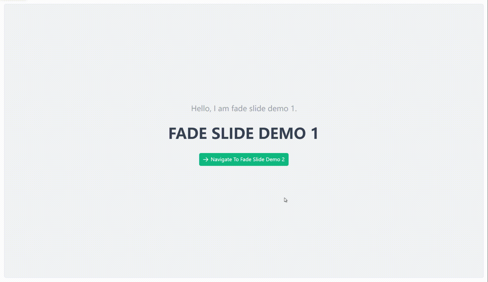

# 淡化滑动 {#fade-slide-router-view}

淡入淡出的同时叠加X轴平移滑动的动画效果。前进时，当前视图向左滑动退出，目标视图向左滑动进入。后退时，当前视图向右滑动退出，目标视图向右滑动进入。

## 基础用法 {#fade-slide-router-view-basic}

```vue
<template>
  <div>
    <VarFadeSlideRouterView />
  </div>
</template>

<script setup lang="ts">
import { VarFadeSlideRouterView } from "vue-animation-router/es";
```

## 运行效果 {#fade-slide-router-view-demo}


