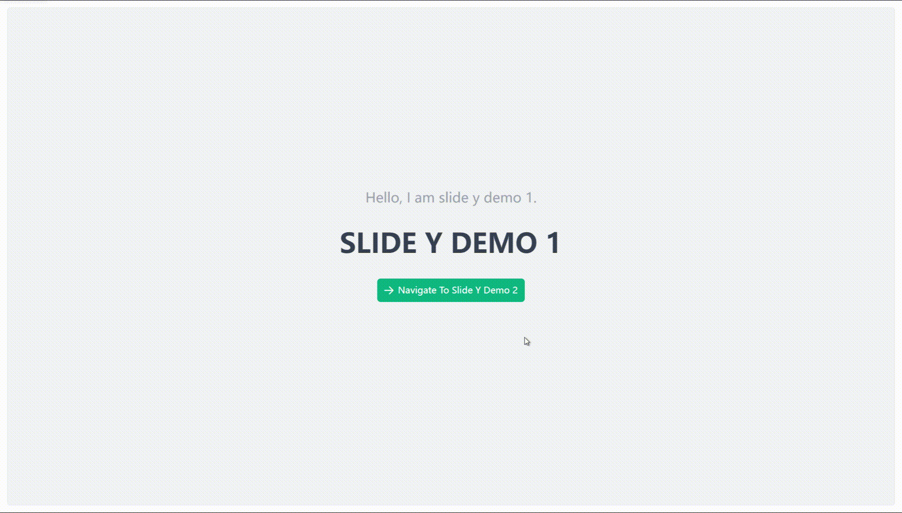

# 滑动（纵向） {#slide-y-router-view}

简单的Y轴滑动动画效果。

## 基础用法 {#slide-y-router-view-basic}

```vue
<template>
  <div>
    <VarSlideYRouterView />
  </div>
</template>

<script setup lang="ts">
import { VarSlideYRouterView } from "vue-animation-router/es";
```

## 运行效果 {#slide-y-router-view-demo}


