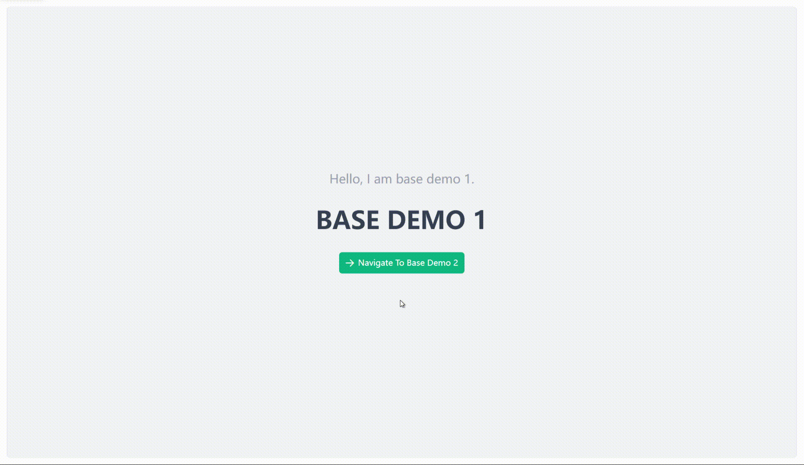

# Basic (No Animation) {#base-router-view}

::: warning Note
`VarBaseRouterView` is a basic router view component used only to display the component content corresponding to the route. It has no animation effects and simply renders the corresponding component. It is not recommended to use this component unless necessary. It is recommended to prefer using the `RouterView` API from Vue Router instead of `VarBaseRouterView`.
:::

## Basic Usage {#base-router-view-basic}

```vue
<template>
  <div>
    <VarBaseRouterView />
  </div>
</template>

<script lang="ts">
import { VarBaseRouterView } from "vue-animation-router/es";

export default defineComponent({
  components: {
    VarBaseRouterView,
  },
});
```

```vue
<template>
  <div>
    <VarBaseRouterView />
  </div>
</template>

<script setup lang="ts">
import { VarBaseRouterView } from "vue-animation-router/es";
```

## Preview {#base-router-view-demo}


