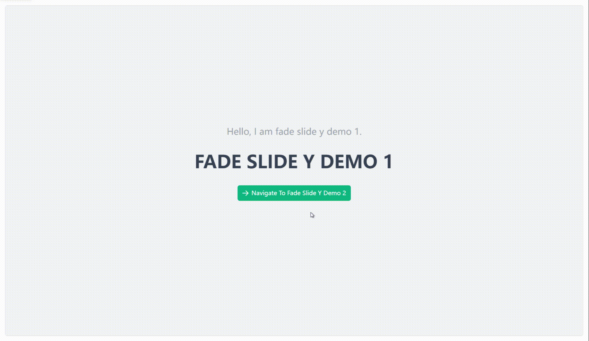

# Fade Slide Y {#fade-slide-y-router-view}

A combination of fade-in/fade-out and Y-axis sliding animation effect. When navigating forward, the current view slides up to exit and the target view slides up to enter. When navigating backward, the current view slides down to exit and the target view slides down to enter.

## Basic Usage {#fade-slide-y-router-view-basic}

```vue
<template>
  <div>
    <VarFadeSlideYRouterView />
  </div>
</template>

<script setup lang="ts">
import { VarFadeSlideYRouterView } from "vue-animation-router/es";
```

## Preview {#fade-slide-y-router-view-demo}


